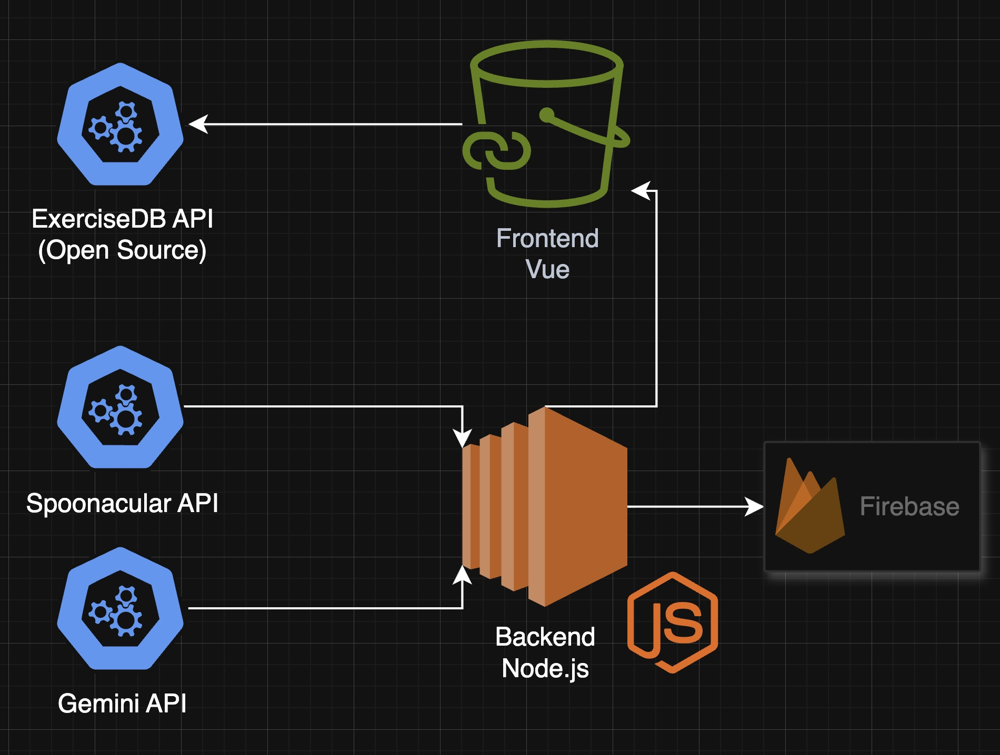
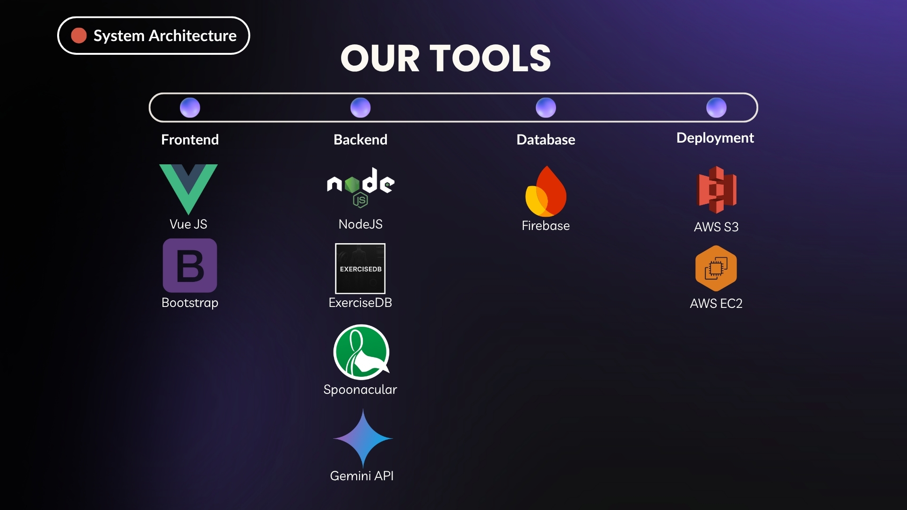

# FitU

Welcome to the GitHub repository for FitU! Whether you're looking to start your fitness journey, or an avid fitness enthusiast, FitU is here to supercharge your productivity and health. 

## Project Overview

Did you know that 61% of Singaporean students feel burnt out from their packed and hectic schedules? Most students feel that they do not have the bandwidth to balance studies, health, and fitness. However, 
FitU is here to solve that. Packed with thoughtful features and an intuitive user interface, FitU's design ensures that you have the best user experience as you record, search and analyse your way to a more healthy life.

## Key Features

- **Calendar Sync** – Import ICS files to sync your schedule with Google or Apple Calendar.  
- **Workout Browser** – Search exercises by muscle group or equipment, complete with video demos.  
- **Workout Sets** – Build, modify, and save your custom workout routines.  
- **AI Coach Assistant** – Get smart workout recommendations tailored to your goals and fitness level.  
- **Workout Vault** – Explore and share community-created workouts.  
- **Recipe Browser** – Discover healthy recipes based on ingredients or meal type.  
- **Virtual Gym** – Explore a 3D gym to learn about different equipment and exercises.  
- **Macros & Fitness Tracking** – Track calories, progress, and workout streaks with charts and graphs.  

## Deployed Link
http://fitu-vue-frontend.s3-website-ap-southeast-1.amazonaws.com/

## Installation

Install FitU with npm <br>

1. Open a terminal and run the following command:
```bash
  cd backend/
  npm install
  node server.js
```
2. Open another terminal and run the following command:
```bash
  cd frontend/
  npm install
  npm run dev
```
3. Start the website on a browser using local host
- http://localhost:5173

## Roles and Responsibilities

| **Name** | **Role** | **Main Contributions** |
|-----------|-----------|------------------------|
| **Dylan** | Project Manager, Full Stack Developer | Managed project timeline, assigned tickets, and hosted stand-up meetings. Developed and integrated **Firebase Auth**, **Spoonacular API**, and **Gemini API (AI Coach)** features. Debugged and refined main website features when necessary. |
| **Junwei** | Frontend Developer | Led frontend design and developed the **Calendar feature**, ensuring smooth syncing with external calendar platforms. |
| **Akash** | Frontend Developer | Co-led frontend design and built the **Virtual Gym**, implementing 3D navigation and interactive equipment exploration. |
| **Justin** | Back End Developer, Video Editor | Implemented the **Workout Cart feature** and produced/edited FitU demo videos. |
| **Yangxue** | Back End Developer, Content Creator | Created the **Profile Details** and **Macros & Fitness Tracking** features, and designed presentation slides. 
| **Flash** | Backend Developer | Developed the **Workout Browser**, **Workout Vault**, and **Comment feature**. |


## High Level System Design

  

## Solution Architecture

  

## APIs

- **NodeJS**: Used to host our backend features.
- **Spoonacular**: Provides recipes for our recipe feature.
- **ExerciseDB**: Provides 1500 exercises for our workout features.
- **Firebase Auth**: User authentication for creating accounts, logging in, and storing user fitness tracking information.
- **Gemini API**: User authentication for creating accounts, logging in, and storing user fitness tracking information.
